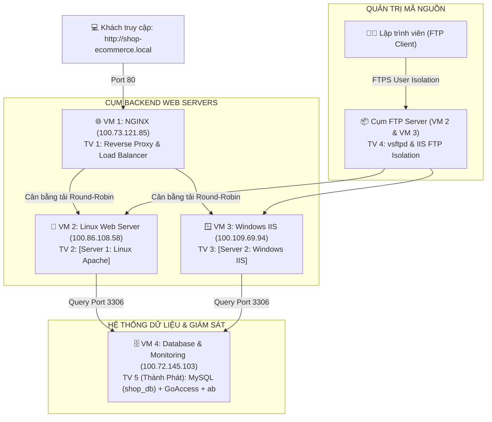

# ĐỀ TÀI 10: TRIỂN KHAI HỆ THỐNG HOSTING E-COMMERCE ĐA NỀN TẢNG
> **Môn học**: Quản trị mạng (Network Administration)  
> **Ứng dụng mẫu**: Nền tảng thương mại điện tử **Techno Store**  
> **Tên miền nội bộ**: `shop-ecommerce.local`  
> **Hạ tầng kết nối mạng**: Mạng lưới liên kết máy ảo qua **Tailscale VPN Mesh Network**

<p align="center">
  
  
  
  
  
  
  
  
</p>

---

## 📑 MỤC LỤC
* [📌 I. Quy hoạch hạ tầng & Dải IP mạng Tailscale](#-i-quy-hoạch-hạ-tầng--dải-ip-mạng-tailscale)
* [🔑 II. Tài khoản dùng thử & Đăng nhập hệ thống (Test Accounts)](#-ii-tài-khoản-dùng-thử--đăng-nhập-hệ-thống-test-accounts)
* [👥 III. Bảng phân công nhiệm vụ theo từng thành viên](#-iii-bảng-phân-công-nhiệm-vụ-theo-từng-thành-viên)
* [🛠️ IV. Hướng dẫn cấu hình chi tiết từng máy chủ](#-iv-hướng-dẫn-cấu-hình-chi-tiết-từng-máy-chủ)
  * [1. VM 1: NGINX Reverse Proxy & Load Balancer (100.73.121.85)](#1-cấu-hình-vm-1-nginx-reverse-proxy--load-balancer-1007312185)
  * [2. VM 2: Linux Apache / CentOS Web Server (100.86.108.58)](#2-cấu-hình-vm-2-linux-apache--centos-web-server-1008610858)
  * [3. VM 3: Windows Server IIS (100.109.69.94)](#3-cấu-hình-vm-3-windows-server-iis-1001096994)
  * [4. Cụm FTP Server với User Isolation (Trên VM 2 & VM 3)](#4-cấu-hình-cụm-ftp-server-với-user-isolation-trên-vm-2--vm-3)
  * [5. VM 4: Database & Monitoring (100.72.145.103)](#5-cấu-hình-vm-4-database--monitoring-10072145103)
* [🎯 V. Kịch bản báo cáo & Demo cho Hội đồng / Giảng viên](#-v-kịch-bản-báo-cáo--demo-cho-hội-đồng--giảng-viên)
  * [Kịch bản 1: Cấu hình DNS phân giải tên miền nội bộ](#kịch-bản-1-cấu-hình-dns-phân-giải-tên-miền-nội-bộ)
  * [Kịch bản 2: Demo Cân bằng tải luân phiên (Round-Robin)](#kịch-bản-2-demo-cân-bằng-tải-luân-phiên-round-robin-load-balancing)
  * [Kịch bản 3: Demo Khả năng Chịu lỗi (Failover trong 2s)](#kịch-bản-3-demo-khả-năng-chịu-lỗi-high-availability---failover-trong-2s)
  * [Kịch bản 4: Demo Cô lập người dùng qua FTP](#kịch-bản-4-demo-cô-lập-người-dùng-qua-ftp-ftp-user-isolation)
  * [Kịch bản 5: Demo Giám sát GoAccess & Bắn tải Apache Benchmark](#kịch-bản-5-demo-giám-sát-thời-gian-thực--bắn-tải-devops)
* [💻 VI. Hướng dẫn chạy thử trực tiếp trên VS Code (Local Dev)](#-vi-hướng-dẫn-chạy-thử-trực-tiếp-trên-vs-code-local-dev)
* [📚 VII. Tài liệu tham khảo (References)](#-vii-tài-liệu-tham-khảo-references)

---

## 📌 I. QUY HOẠCH HẠ TẦNG & DẢI IP MẠNG TAILSCALE

Hệ thống cụm máy ảo được kết nối thông suốt với nhau thông qua mạng ảo riêng ảo hóa **Tailscale VPN** (chạy trên dải IP `100.x.x.x`):

| Vai trò máy chủ (Node) | Tailscale Hostname | Hệ điều hành | Dịch vụ chính | Địa chỉ IP Tailscale | Cổng dịch vụ (Port) |
| :--- | :--- | :--- | :--- | :--- | :--- |
| **VM 1: NGINX** | `localhost-0` | Linux (Ubuntu Server) | Reverse Proxy & Load Balancer | **`100.73.121.85`** | `80` (HTTP), `443` (HTTPS) |
| **VM 2: Linux Web Server** | `web-centos` | Linux (CentOS / Ubuntu) | Web Server Backend (Apache/PHP) & FTP | **`100.86.108.58`** | `80` (HTTP), `21` + `40000:40100` (FTP) |
| **VM 3: Windows IIS** *(Máy bạn)* | `win-7n4gk2a89pl` | Windows Server | Web Server Backend (IIS + PHP) & FTP | **`100.109.69.94`** | `80` (HTTP), `21` + `5000:5100` (FTP) |
| **VM 4: Database** *(Thành Phát)* | `thanhphat-virtualbox` | Linux (Ubuntu) | MySQL/MariaDB Server & Monitoring | **`100.72.145.103`** | `3306` (MySQL), `7890` (GoAccess Web) |

> 🌐 **Tailscale Funnel Public URL (Node IIS của bạn)**: `https://win-7n4gk2a89pl.taileee594.ts.net`

---

## 🔑 II. TÀI KHOẢN DÙNG THỬ & ĐĂNG NHẬP HỆ THỐNG (TEST ACCOUNTS)

Hệ thống đã cấu hình sẵn các tài khoản mẫu để phục vụ cho việc kiểm thử và chấm điểm đồ án:

| Vai trò (Role) | Tên đăng nhập / Email | Mật khẩu | Quyền hạn & Chức năng |
| :--- | :--- | :--- | :--- |
| **1. Quản trị viên (Admin)** | **`admin`** | **`admin123`** | **Toàn quyền quản trị**: Quản lý sản phẩm, đơn hàng, danh mục, thiết lập giá bán, kiểm soát kho hàng và khóa/mở tài khoản khách. *(Cách vào: Bấm "Đăng nhập" ở góc trên ➔ chọn "Cổng đăng nhập dành cho Quản trị viên", hoặc bấm "Cổng quản trị →" ở chân trang).* |
| **2. Khách hàng (Customer)** | **`minhanh@mail.com`** | **`password`** | **Tài khoản người dùng mẫu** (*Nguyễn Minh Anh*): Xem giỏ hàng, thông tin cá nhân, lịch sử đơn mua, đổi địa chỉ nhận hàng và đặt hàng mới. |
| **3. Lập trình viên FTP (Dev)** | **`dev_linux`** / **`dev_windows`** | *(Tự đặt khi tạo user)* | Upload mã nguồn vào thư mục web qua FTP với tính năng cô lập người dùng (**User Isolation / chroot**). |
| **4. Dịch vụ Database (MySQL)** | **`shop_user`** | **`Shop@123456`** | Tài khoản kết nối từ xa vào CSDL tập trung `shop_db` tại máy Thành Phát (`100.72.145.103:3306`). |

---

## 👥 III. BẢNG PHÂN CÔNG NHIỆM VỤ THEO TỪNG THÀNH VIÊN
*(Theo phân công chi tiết tại tài liệu [Document-1.pdf](file:///d:/Work_Project/QTM/Network-administrator/Document-1.pdf))*



| STT | Thành viên & Định hướng | Máy chủ phụ trách | Nhiệm vụ Giai đoạn 1 (Khung hạ tầng & Web tĩnh) | Nhiệm vụ Giai đoạn 2 (Backend, Database & Cloud) |
| :---: | :--- | :--- | :--- | :--- |
| **1** | **Thành viên 1**<br>*(Network & Cloud Admin)* | **VM 1: NGINX**<br>`100.73.121.85` | • Cài đặt NGINX Reverse Proxy trên Ubuntu.<br>• Cấu hình khối upstream cân bằng tải (Round-Robin).<br>• Cấu hình tham số Failover (`max_fails=2`, `fail_timeout=5s`) phát hiện server sập trong 2s.<br>• Thêm header `Cache-Control "no-store"` chặn cache trình duyệt khi test F5. | • Cấu hình Virtual Host chạy tên miền nội bộ `shop-ecommerce.local`.<br>• Tối ưu hiệu năng NGINX: bật nén Gzip nội dung tĩnh.<br>• Hỗ trợ cấu hình tích hợp Cloud kết nối ra ngoài. |
| **2** | **Thành viên 2**<br>*(Linux Admin & Web Dev)* | **VM 2: Linux Web Server**<br>`100.86.108.58` | • Cài đặt dịch vụ Apache Web Server trên Linux.<br>• Phân quyền sở hữu thư mục `/var/www/html` (`chmod`/`chown`).<br>• Dựng mã nguồn HTML/CSS bán hàng mẫu có banner phân biệt: `"[Server 1: Linux Apache]"`.<br>• Mở port 80/443 trên tường lửa `ufw` / `firewalld`. | • Cài đặt môi trường PHP trên Linux (`php`, `php-mysql`).<br>• Viết mã nguồn PHP kết nối sang Database tập trung (VM 4 - `100.72.145.103`) để hiển thị danh sách sản phẩm.<br>• Trỏ link ảnh sản phẩm sang Cloud S3. |
| **3** | **Thành viên 3 (Bạn)**<br>*(Windows System Admin)* | **VM 3: Windows IIS**<br>`100.109.69.94` | • Cài đặt vai trò Web Server (IIS) qua Server Manager.<br>• Cấu hình Site Binding (Port 80) và quản trị thư mục `C:\inetpub\wwwroot`.<br>• Đồng bộ mã nguồn HTML/CSS mẫu có banner phân biệt: `"[Server 2: Windows IIS]"`.<br>• Mở port 80 trên Windows Defender Firewall.<br>• Bật tính năng Tailscale Funnel. | • Cài đặt môi trường PHP trên Windows IIS (dùng PHP Manager hoặc FastCGI).<br>• Đưa mã nguồn kết nối Database sang IIS, đảm bảo truy vấn cùng dữ liệu với máy Linux.<br>• Trỏ link ảnh sản phẩm sang Cloud S3. |
| **4** | **Thành viên 4**<br>*(Bảo mật & FTP Isolation)* | **Cụm FTP Server**<br>*(Trên VM 2 & VM 3)* | • Cài đặt `vsftpd` trên Linux, cấu hình `chroot_local_user=YES` để cô lập dev vào đúng `/var/www/html`.<br>• Cài đặt FTP Service trên IIS (Windows Server), bật chế độ **FTP User Isolation**.<br>• Cấu hình dải Port thụ động (Passive Ports) và mở Port 21 trên Firewall của cả Linux và Windows. | • Thiết lập FTPS (FTP over SSL/TLS) mã hóa dữ liệu truyền tải.<br>• Phân quyền tài khoản dev chi tiết (chống xóa nhầm file hệ thống). |
| **5** | **Thành viên 5 (Thành Phát)**<br>*(Database, DevOps & Cloud)* | **VM 4: Database & Monitoring**<br>`100.72.145.103` | • Cài đặt MySQL/MariaDB Server, tạo CSDL `shop_db` và bảng dữ liệu sản phẩm `products`.<br>• Cấu hình mở kết nối từ xa (`bind-address = 0.0.0.0`, port 3306), phân quyền cho IP của VM 2 (`100.86.108.58`) và VM 3 (`100.109.69.94`).<br>• Cài đặt công cụ giám sát trực quan (**GoAccess**) để phân tích log NGINX theo thời gian thực.<br>• Dùng công cụ **Apache Benchmark (`ab`)** bắn tải kiểm thử hệ thống. | • Khởi tạo Bucket lưu trữ trên Cloud (AWS S3 / Cloudflare R2 hoặc MinIO).<br>• Đẩy toàn bộ ảnh sản phẩm lên Cloud Bucket.<br>• Cung cấp URL ảnh trên Cloud để TV 2 và TV 3 nhúng vào mã nguồn web. |

---

## 🛠️ IV. HƯỚNG DẪN CẤU HÌNH CHI TIẾT TỪNG MÁY CHỦ

### 1. Cấu hình VM 1: NGINX Reverse Proxy & Load Balancer (`100.73.121.85`)
*Người phụ trách: Thành viên 1*

1. **Cài đặt NGINX trên Ubuntu**:
   ```bash
   sudo apt update
   sudo apt install nginx -y
   ```
2. **Tạo file cấu hình Virtual Host & Load Balancer**:
   Tạo file `/etc/nginx/conf.d/shop-ecommerce.conf`:
   ```bash
   sudo nano /etc/nginx/conf.d/shop-ecommerce.conf
   ```
   Dán nội dung cấu hình chuẩn với IP Tailscale thực tế:
   ```nginx
   # Khối Upstream cân bằng tải Round-Robin trỏ về 2 Node Web Server
   upstream backend_servers {
       server 100.86.108.58:80 max_fails=2 fail_timeout=5s; # Node 1: Linux Apache / CentOS
       server 100.109.69.94:80 max_fails=2 fail_timeout=5s; # Node 2: Windows Server IIS
   }

   server {
       listen 80;
       server_name shop-ecommerce.local www.shop-ecommerce.local;

       # Tối ưu hóa hiệu năng: Bật nén Gzip nội dung tĩnh
       gzip on;
       gzip_types text/plain text/css application/json application/javascript text/xml application/xml;
       gzip_min_length 1000;

       location / {
           proxy_pass http://backend_servers;
           
           # Truyền thông tin Client thật đến backend
           proxy_set_header Host $host;
           proxy_set_header X-Real-IP $remote_addr;
           proxy_set_header X-Forwarded-For $proxy_add_x_forwarded_for;
           proxy_set_header X-Forwarded-Proto $scheme;

           # Chặn cache trình duyệt khi test F5 liên tục
           add_header Cache-Control "no-store, no-cache, must-revalidate, max-age=0";
           add_header Pragma "no-cache";

           # Tự động chuyển node trong 2 giây nếu có server sập
           proxy_connect_timeout 2s;
           proxy_read_timeout 5s;
           proxy_next_upstream error timeout http_500 http_502 http_503 http_504;
       }
   }
   ```
3. **Kiểm tra và kích hoạt NGINX**:
   ```bash
   sudo nginx -t
   sudo systemctl restart nginx
   ```

---

### 2. Cấu hình VM 2: Linux Apache / CentOS Web Server (`100.86.108.58`)
*Người phụ trách: Thành viên 2*

1. **Cài đặt Apache & PHP**:
   ```bash
   sudo apt update
   sudo apt install apache2 php libapache2-mod-php php-mysql -y
   sudo a2enmod rewrite headers
   sudo systemctl restart apache2
   ```
2. **Đưa mã nguồn vào thư mục web**:
   * Copy toàn bộ thư mục `Network-administrator` vào `/var/www/html`.
3. **Cấu hình banner phân biệt Node**:
   * Mở file `config.js`, đặt:
     ```javascript
     currentNode: "[Server 1: Linux Apache]"
     ```
4. **Phân quyền thư mục**:
   ```bash
   sudo chown -R www-data:www-data /var/www/html
   sudo chmod -R 755 /var/www/html
   sudo chmod -R 775 /var/www/html/api/data
   ```
5. **Mở port trên tường lửa**:
   ```bash
   sudo ufw allow 80/tcp
   sudo ufw allow 443/tcp
   sudo ufw allow 21/tcp
   sudo ufw allow 40000:40100/tcp
   sudo ufw reload
   ```

---

### 3. Cấu hình VM 3: Windows Server IIS (`100.109.69.94`)
*Người phụ trách: Thành viên 3 (Bạn)*

1. **Cài đặt vai trò IIS qua Server Manager**:
   * Mở **Server Manager** ➔ **Add roles and features** ➔ Chọn **Web Server (IIS)**.
   * Trong phần *Application Development*, chọn cài đặt **CGI**.
   * Cài đặt **URL Rewrite Module 2.1** cho IIS.
2. **Cài đặt PHP trên IIS**:
   * Cài đặt PHP Manager for IIS hoặc giải nén PHP vào `C:\PHP` và cấu hình FastCGI handler cho đuôi `.php`.
   * Bật extension `pdo_mysql` trong file `php.ini`.
3. **Đưa mã nguồn vào IIS**:
   * Copy toàn bộ thư mục dự án vào `C:\inetpub\wwwroot`.
4. **Cấu hình banner phân biệt Node**:
   * Mở file `config.js`, đặt:
     ```javascript
     currentNode: "[Server 2: Windows IIS]"
     ```
5. **Phân quyền thư mục và mở Firewall**:
   * Chuột phải `C:\inetpub\wwwroot\api\data` ➔ **Properties** ➔ **Security** ➔ Cấp quyền **Write** cho `IIS_IUSRS`.
   * Mở **Windows Defender Firewall with Advanced Security** ➔ Inbound Rules ➔ Mở Port **80** (HTTP) và Port **21** (FTP).
6. **Bật Tailscale Funnel (Truy cập từ Internet)**:
   ```cmd
   tailscale funnel 80
   ```

---

### 4. Cấu hình Cụm FTP Server với User Isolation (Trên VM 2 & VM 3)
*Người phụ trách: Thành viên 4*

#### A. Cấu hình trên Linux (VM 2) với `vsftpd`:
1. Cài đặt `vsftpd`:
   ```bash
   sudo apt install vsftpd -y
   ```
2. Cấu hình `/etc/vsftpd.conf`:
   ```ini
   listen=YES
   anonymous_enable=NO
   local_enable=YES
   write_enable=YES
   chroot_local_user=YES
   allow_writeable_chroot=YES
   pasv_enable=YES
   pasv_min_port=40000
   pasv_max_port=40100
   ```
3. Tạo user developer và khóa vào `/var/www/html`:
   ```bash
   sudo useradd -m -d /var/www/html dev_linux
   sudo passwd dev_linux
   sudo chown -R dev_linux:www-data /var/www/html
   sudo systemctl restart vsftpd
   ```

#### B. Cấu hình trên Windows IIS (VM 3) với FTP User Isolation:
1. Trong Server Manager, cài đặt thêm tính năng **FTP Server** & **FTP Service**.
2. Mở IIS Manager ➔ Chuột phải Sites ➔ **Add FTP Site**:
   * Binding: Port 21, No SSL (hoặc chọn FTPS with certificate).
   * Authentication: Basic, Authorization: Specified users (`dev_windows` có quyền Read/Write).
   * Chọn tính năng **FTP User Isolation** ➔ Chọn **Isolate users. Restrict users to the following directory** (User name directory).

---

### 5. Cấu hình VM 4: Database & Monitoring (`100.72.145.103`)
*Người phụ trách: Thành viên 5 (Thành Phát)*

1. **Cài đặt MariaDB / MySQL Server**:
   ```bash
   sudo apt update
   sudo apt install mariadb-server -y
   ```
2. **Mở kết nối từ xa trên MySQL**:
   * Mở file cấu hình `/etc/mysql/mariadb.conf.d/50-server.cnf`:
     ```ini
     bind-address = 0.0.0.0
     ```
   * Khởi động lại MySQL: `sudo systemctl restart mariadb`.
3. **Khởi tạo CSDL `shop_db`**:
   * Import file [database.sql](file:///d:/Work_Project/QTM/Network-administrator/database.sql) có sẵn trong dự án:
     ```bash
     sudo mysql < database.sql
     ```
     *(Lệnh này sẽ tự động tạo bảng `products`, `orders` và cấp quyền kết nối từ xa cho dải IP Tailscale `100.%` với user `shop_user` / password `Shop@123456`).*
4. **Cài đặt GoAccess giám sát thời gian thực log NGINX**:
   ```bash
   sudo apt install goaccess -y
   goaccess /var/log/nginx/access.log -o /var/www/html/report.html --log-format=COMBINED --real-time-html
   ```
5. **Dùng Apache Benchmark (`ab`) bắn tải kiểm thử**:
   ```bash
   sudo apt install apache2-utils -y
   ab -n 5000 -c 100 http://100.73.121.85/
   ```

---

## 🎯 V. KỊCH BẢN BÁO CÁO & DEMO CHO HỘI ĐỒNG / GIẢNG VIÊN

### Kịch bản 1: Cấu hình DNS phân giải tên miền nội bộ
1. Trên máy thật hoặc máy client trong mạng Tailscale, mở file hosts (`C:\Windows\System32\drivers\etc\hosts` trên Windows hoặc `/etc/hosts` trên Linux):
   ```text
   100.73.121.85   shop-ecommerce.local
   ```
2. Mở trình duyệt truy cập: **`http://shop-ecommerce.local`**. Trang web Techno Store sẽ hiển thị mượt mà.

### Kịch bản 2: Demo Cân bằng tải luân phiên (Round-Robin Load Balancing)
1. Truy cập vào IP NGINX `http://100.73.121.85/`.
2. Bấm nút **`🔄 Kiểm tra`** hoặc nhấn **`F5`**:
   * Request 1: Phản hồi từ **`[Server 1: Linux Apache]`** (`100.86.108.58`).
   * Request 2: Phản hồi từ **`[Server 2: Windows IIS]`** (`100.109.69.94`).
   👉 **Khẳng định**: NGINX đã điều phối tải luân phiên chính xác giữa hai hệ điều hành khác nhau.

### Kịch bản 3: Demo Khả năng Chịu lỗi (High Availability - Failover trong 2s)
1. Trên máy Linux (VM 2), giả lập sự cố sập server:
   ```bash
   sudo systemctl stop apache2
   ```
2. Trên trình duyệt, nhấn F5 liên tục:
   * NGINX phát hiện node Linux sập trong vòng 2 giây (`fail_timeout=5s, max_fails=2`).
   * **100% request chuyển mượt sang Windows IIS (VM 3 - `100.109.69.94`)**.
   * Website không hề gián đoạn, khách mua hàng không nhận bất kỳ lỗi 502/504 nào.
3. Bật lại Apache: `sudo systemctl start apache2`. Hệ thống tự động phục hồi cân bằng tải.

### Kịch bản 4: Demo Cô lập người dùng qua FTP (FTP User Isolation)
1. Mở FileZilla từ máy client, kết nối đến `100.86.108.58` với tài khoản `dev_linux`.
2. Chứng minh: User chỉ được xem thư mục `/var/www/html`, khi cố gắng gõ `cd /etc` hoặc `cd /root` thì hệ thống sẽ từ chối truy cập (nhờ tính năng `chroot`).

### Kịch bản 5: Demo Giám sát thời gian thực & Bắn tải (DevOps)
1. Mở giao diện GoAccess trên trình duyệt: `http://100.72.145.103:7890`.
2. Từ terminal VM 4, chạy lệnh bắn tải: `ab -n 2000 -c 50 http://100.73.121.85/`.
3. Cho giảng viên quan sát lưu lượng đồ thị request tăng đột biến trên GoAccess, chứng minh hệ thống cụm chịu tải tốt và không có request nào bị drop.

---

## 💻 VI. HƯỚNG DẪN CHẠY THỬ TRỰC TIẾP TRÊN VS CODE (LOCAL DEV)

Nếu bạn đang code hoặc kiểm tra trên máy tính cá nhân bằng VS Code:
1. Mở Terminal tại thư mục dự án (`Ctrl + ~`).
2. Gõ lệnh:
   ```bash
   npm start
   ```
3. Trình duyệt tự động mở tại **`http://localhost:3000`** với đầy đủ mock API và giao diện hoàn chỉnh.
4. Bấm `Ctrl + C` để dừng server.

---

## 📚 VII. TÀI LIỆU THAM KHẢO (REFERENCES)

1. **NGINX Reverse Proxy & HTTP Load Balancing**:
   * [NGINX Documentation: Using NGINX as an HTTP Load Balancer](https://docs.nginx.com/nginx/admin-guide/load-balancer/http-load-balancer/)
   * [NGINX Reverse Proxy Official Guide](https://docs.nginx.com/nginx/admin-guide/web-server/reverse-proxy/)
   * [NGINX Module ngx_http_upstream_module Reference](https://nginx.org/en/docs/http/ngx_http_upstream_module.html)

2. **Microsoft Internet Information Services (IIS)**:
   * [Microsoft Learn: URL Rewrite Module 2.0 / 2.1 Configuration Reference](https://learn.microsoft.com/en-us/iis/extensions/url-rewrite-module/url-rewrite-module-configuration-reference)
   * [Microsoft Learn: Configuring PHP on IIS using FastCGI](https://learn.microsoft.com/en-us/iis/application-frameworks/install-and-configure-php-on-iis/configure-the-fastcgi-extension-for-iis)
   * [Microsoft Learn: Configuring FTP User Isolation in IIS](https://learn.microsoft.com/en-us/iis/configuration/system.applicationHost/sites/siteDefaults/ftpServer/userIsolation)

3. **Apache HTTP Server**:
   * [Apache HTTP Server Documentation: Module mod_rewrite](https://httpd.apache.org/docs/2.4/mod/mod_rewrite.html)
   * [Apache Tutorial: .htaccess files and Security Configuration](https://httpd.apache.org/docs/2.4/howto/htaccess.html)

4. **FTP Server Security & User Isolation**:
   * [vsftpd Official Documentation & Configuration Manual](https://security.appspot.com/vsftpd/vsftpd_conf.html)
   * [RFC 959: File Transfer Protocol (FTP) Specification](https://datatracker.ietf.org/doc/html/rfc959)
   * [RFC 4217: Securing FTP with TLS (FTPS)](https://datatracker.ietf.org/doc/html/rfc4217)

5. **Mạng lưới VPN & Liên kết máy ảo**:
   * [Tailscale Official Documentation: Tailscale Mesh Architecture & VPN](https://tailscale.com/kb)
   * [Tailscale Funnel Documentation: Expose local servers to the Internet](https://tailscale.com/kb/1223/funnel)

6. **Giám sát & Kiểm thử hiệu năng (DevOps & Testing)**:
   * [GoAccess: Official Real-Time Web Log Analyzer Documentation](https://goaccess.io/man)
   * [Apache Benchmark (ab): Official Apache HTTP Server Benchmarking Tool](https://httpd.apache.org/docs/2.4/programs/ab.html)
   * [MariaDB / MySQL Knowledge Base: Configuring Remote Connections and User Grants](https://mariadb.com/kb/en/configuring-mariadb-for-remote-client-access/)