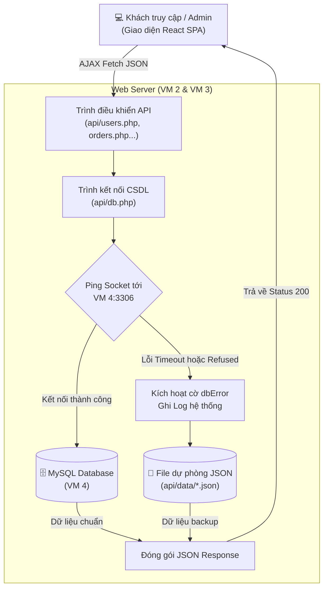
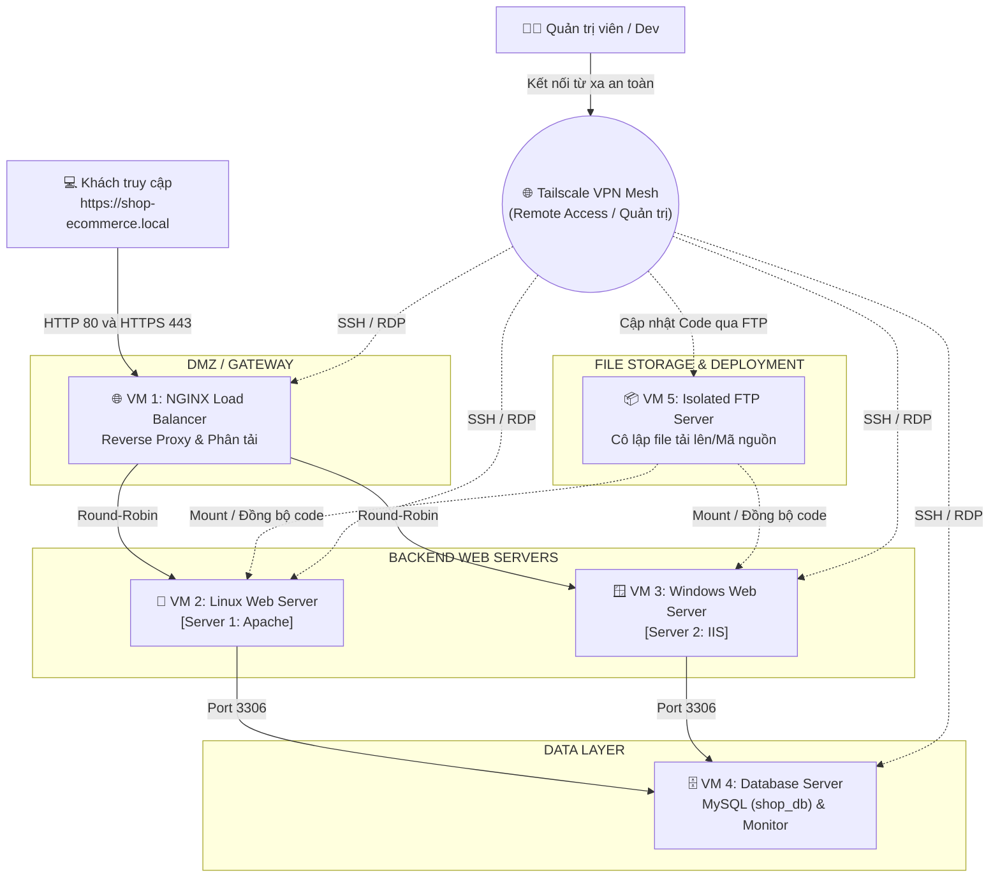
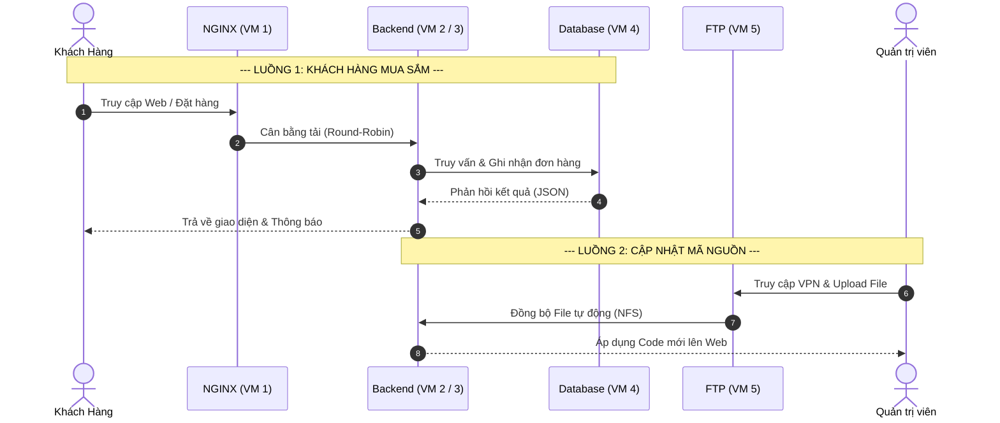

# ĐỀ TÀI 10: TRIỂN KHAI HỆ THỐNG HOSTING E-COMMERCE ĐA NỀN TẢNG
> **Môn học**: Quản trị mạng (Network Administration)  
> **Ứng dụng mẫu**: Nền tảng thương mại điện tử **Phone Store**  
> **Tên miền nội bộ**: `shop-ecommerce.local`  
> **Hạ tầng kết nối mạng**: Mạng lưới liên kết máy ảo qua **Tailscale VPN Mesh Network**

<p align="center">
  
  
  
  
  
  
  
  
</p>

---

## 📑 MỤC LỤC
* [📌 I. Quy hoạch hạ tầng & Dải IP mạng Tailscale](#-i-quy-hoạch-hạ-tầng--dải-ip-mạng-tailscale)
* [🔑 II. Tài khoản dùng thử & Đăng nhập hệ thống (Test Accounts)](#-ii-tài-khoản-dùng-thử--đăng-nhập-hệ-thống-test-accounts)
* [📁 III. Cấu trúc thư mục & Kiến trúc module dự án](#-iii-cấu-trúc-thư-mục--kiến-trúc-module-dự-án)
* [⚡ IV. Đặc tả hệ thống RESTful API & Cơ chế chịu lỗi CSDL](#-iv-đặc-tả-hệ-thống-restful-api--cơ-chế-chịu-lỗi-csdl)
* [🌐 V. Sơ đồ kiến trúc mạng & kết nối hệ thống](#-v-sơ-đồ-kiến-trúc-mạng--kết-nối-hệ-thống)
* [🛠️ VI. Hướng dẫn cấu hình chi tiết từng máy chủ](#-vi-hướng-dẫn-cấu-hình-chi-tiết-từng-máy-chủ)
  * [1. VM 1: NGINX Reverse Proxy & Load Balancer (100.73.121.85)](#1-cấu-hình-vm-1-nginx-reverse-proxy--load-balancer-1007312185)
  * [2. VM 2: Linux Apache / CentOS Web Server (100.86.108.58)](#2-cấu-hình-vm-2-linux-apache--centos-web-server-1008610858)
  * [3. VM 3: Windows Server IIS (100.109.69.94)](#3-cấu-hình-vm-3-windows-server-iis-1001096994)
  * [4. Cụm FTP Server với User Isolation (Trên VM 2 & VM 3)](#4-cấu-hình-cụm-ftp-server-với-user-isolation-trên-vm-2--vm-3)
  * [5. VM 4: Database & Monitoring (100.72.145.103)](#5-cấu-hình-vm-4-database--monitoring-10072145103)
* [🎯 VII. Kịch bản báo cáo & Demo cho Hội đồng / Giảng viên](#-vii-kịch-bản-báo-cáo--demo-cho-hội-đồng--giảng-viên)
  * [Kịch bản 1: Cấu hình DNS phân giải tên miền nội bộ](#kịch-bản-1-cấu-hình-dns-phân-giải-tên-miền-nội-bộ)
  * [Kịch bản 2: Demo Cân bằng tải luân phiên (Round-Robin)](#kịch-bản-2-demo-cân-bằng-tải-luân-phiên-round-robin-load-balancing)
  * [Kịch bản 3: Demo Khả năng Chịu lỗi (Failover trong 2s)](#kịch-bản-3-demo-khả-năng-chịu-lỗi-high-availability---failover-trong-2s)
  * [Kịch bản 4: Demo Cô lập người dùng qua FTP](#kịch-bản-4-demo-cô-lập-người-dùng-qua-ftp-ftp-user-isolation)
  * [Kịch bản 5: Demo Giám sát GoAccess & Bắn tải Apache Benchmark](#kịch-bản-5-demo-giám-sát-thời-gian-thực--bắn-tải-devops)
* [💻 VIII. Hướng dẫn chạy thử trực tiếp trên VS Code (Local Dev)](#-viii-hướng-dẫn-chạy-thử-trực-tiếp-trên-vs-code-local-dev)
* [📚 IX. Tài liệu tham khảo & Trích dẫn Nguồn mở (References)](#-ix-tài-liệu-tham-khảo--trích-dẫn-nguồn-mở-references)

---

## 📌 I. QUY HOẠCH HẠ TẦNG & DẢI IP MẠNG TAILSCALE

Hệ thống cụm máy ảo được kết nối thông suốt với nhau thông qua mạng ảo riêng ảo hóa **Tailscale VPN** (chạy trên dải IP `100.x.x.x`):

| Vai trò máy chủ (Node) | Tailscale Hostname | Hệ điều hành | Dịch vụ chính | Địa chỉ IP Tailscale | Cổng dịch vụ (Port) |
| :--- | :--- | :--- | :--- | :--- | :--- |
| **VM 1: NGINX** | `localhost-0` | Linux (Ubuntu Server) | Reverse Proxy & Load Balancer | **`100.73.121.85`** | `80` (HTTP), `443` (HTTPS) |
| **VM 2: Linux Web Server** | `web-centos` | Linux (CentOS / Ubuntu) | Web Server Backend (Apache/PHP) | **`100.86.108.58`** | `80` (HTTP) |
| **VM 3: Windows IIS** | `win-7n4gk2a89pl` | Windows Server | Web Server Backend (IIS + PHP) | **`100.109.69.94`** | `80` (HTTP) |
| **VM 4: Database** | `thanhphat-virtualbox` | Linux (Ubuntu) | MySQL/MariaDB Server & Monitoring | **`100.72.145.103`** | `3306` (MySQL), `7890` (GoAccess) |
| **VM 5: FTP Server (Cô lập)** | `ftp-server` | Linux / Windows | Máy chủ truyền tải mã nguồn cô lập | **`100.x.x.x`** | `21` (FTP/FTPS) |

> 🌐 **Tailscale Funnel Public URL (Node IIS)**: `https://win-7n4gk2a89pl.taileee594.ts.net`

---

## 🔑 II. TÀI KHOẢN DÙNG THỬ & ĐĂNG NHẬP HỆ THỐNG (TEST ACCOUNTS)

Hệ thống đã cấu hình sẵn các tài khoản để phục vụ việc kiểm thử, demo và chấm điểm đồ án:

| Vai trò (Role) | Tên đăng nhập / Email | Mật khẩu | Quyền hạn & Hướng dẫn truy cập |
| :--- | :--- | :--- | :--- |
| **1. Quản trị viên (Admin)** | **`admin`** | **`admin123`** | **Toàn quyền quản trị**: Quản lý kho hàng, cập nhật giá & số lượng tồn kho, duyệt đơn hàng, thống kê doanh thu và quản lý danh sách khách hàng.<br>👉 **Cách vào**: Truy cập thẳng vào URL **`/admin`** (ví dụ `http://shop-ecommerce.local/admin` hoặc `http://localhost:3000/admin`), hoặc bấm liên kết **"Cổng quản trị →"** tại chân trang (Footer). |
| **2. Lập trình viên FTP (Dev)** | **`dev_linux`** / **`dev_windows`** | *(Tự đặt khi tạo user)* | Upload mã nguồn vào thư mục web qua FTP với tính năng cô lập người dùng (**User Isolation / chroot**). |
| **3. Dịch vụ Database (MySQL)** | **`shop_user`** | **`Shop@123456`** | Tài khoản kết nối từ xa vào CSDL tập trung `shop_db` tại máy (`100.72.145.103:3306`). |

> 💡 **Lưu ý đối với Khách hàng**: Vì đây là đề tài Quản trị mạng (tập trung vào hạ tầng và phân tải), hệ thống mở hoàn toàn cho việc trải nghiệm luồng mua sắm: người dùng có thể nhập bất kỳ Email/Họ tên nào để đăng ký/đặt hàng trực tiếp trên giao diện mà không cần qua bước OTP xác thực email phức tạp. Dữ liệu sau khi đăng ký hoặc đặt hàng sẽ được đồng bộ tức thì sang CSDL/JSON và hiển thị trực tiếp trên trang Quản trị.

---

## 📁 III. CẤU TRÚC THƯ MỤC & KIẾN TRÚC MODULE DỰ ÁN

Toàn bộ mã nguồn dự án được tổ chức theo kiến trúc module hóa chuyên nghiệp, tách biệt rõ ràng giữa Frontend khách hàng, Bảng điều khiển quản trị (Admin) và Cụm API dịch vụ:

```text
Network-administrator/
├── admin/                        # 🎛️ Phân hệ Bảng điều khiển Quản trị viên
│   ├── css/
│   │   └── admin.css             # CSS tách riêng độc lập của Admin (Gọn nhẹ, không xung đột)
│   ├── js/
│   │   └── admin.js              # Xử lý logic đồng bộ thời gian thực (Orders, Users, Inventory)
│   └── index.html                # Giao diện Dashboard điều hành hệ thống
├── api/                          # 🌐 Cụm RESTful API Backend (Hỗ trợ cả PHP & Node.js)
│   ├── products.php              # API quản lý sản phẩm, tồn kho, giá bán
│   ├── orders.php                # API tiếp nhận đặt hàng, đổi trạng thái đơn
│   ├── users.php                 # API đăng ký & danh sách người dùng thực tế
│   ├── dashboard.php             # API tổng hợp chỉ số doanh thu & báo cáo
│   ├── server-info.php           # API nhận diện thông tin Node Server (Phục vụ cân bằng tải)
│   ├── db.php                    # Trình điều khiển kết nối MySQL PDO
│   └── data/                     # 💾 Kho lưu trữ dữ liệu dự phòng (JSON Fallback Storage)
│       ├── products.json         # Dữ liệu sản phẩm nội bộ
│       ├── orders.json           # Dữ liệu đơn hàng nội bộ
│       └── users.json            # Dữ liệu khách hàng thực tế đã đăng ký
├── assets/                       # ⚛️ Frontend React SPA dành cho khách mua sắm
│   ├── main.js                   # Mã nguồn React tối ưu hóa
│   └── style.css                 # Hệ thống CSS giao diện cửa hàng
├── custom.js                     # Script mở rộng và hỗ trợ đồng bộ dữ liệu
├── custom.css                    # Tùy biến kiểu dáng hiển thị bổ sung
├── config.js                     # Cấu hình định danh từng máy chủ ([Server 1] / [Server 2])
├── database.sql                  # Script khởi tạo trọn vẹn CSDL MySQL tập trung (VM 4)
├── server.js                     # Full-stack Local Dev Server (Hỗ trợ test nhanh không cần cài PHP)
├── .htaccess                     # Cấu hình định tuyến URL Rewrite cho Apache (Linux)
└── web.config                    # Cấu hình định tuyến URL Rewrite cho IIS (Windows Server)
```

---

## ⚡ IV. ĐẶC TẢ HỆ THỐNG RESTFUL API & CƠ CHẾ CHỊU LỖI CSDL

### 1. Danh sách RESTful API Endpoints

Cả hai Node Web Server (Apache và IIS) đều cung cấp cụm API chuẩn RESTful định dạng JSON:

| Phương thức | Endpoint | Chức năng chính | Tham số / Dữ liệu gửi lên |
| :---: | :--- | :--- | :--- |
| **`GET`** | `/api/products.php` | Lấy danh sách sản phẩm hiển thị cửa hàng | `?category=...`, `?search=...` |
| **`POST`** | `/api/products.php` | Thêm, sửa, xóa hoặc cập nhật kho hàng | JSON body: `{ action, product/stock }` |
| **`GET`** | `/api/orders.php` | Lấy toàn bộ danh sách đơn đặt hàng | Hỗ trợ xem chi tiết sản phẩm, trạng thái |
| **`POST`** | `/api/orders.php` | Tạo đơn hàng mới từ giỏ hàng hoặc đổi trạng thái | JSON body: `{ customer, phone, items, total, ... }` |
| **`GET`** | `/api/users.php` | Lấy danh sách tài khoản khách hàng thực tế | Trả về ID, tên, email, ngày tham gia |
| **`POST`** | `/api/users.php` | Tiếp nhận đăng ký tài khoản mới từ khách | JSON body: `{ name, email, phone, password }` |
| **`GET`** | `/api/dashboard.php` | Thống kê doanh thu, tổng số đơn, tồn kho | Trả về số liệu cho Dashboard Admin |
| **`GET`** | `/api/server-info.php` | Kiểm tra Node phục vụ (IP, Node Name, OS) | Phục vụ kiểm thử cân bằng tải luân phiên |

### 2. Cơ chế chịu lỗi CSDL thông minh (Dual-Storage Fallback)

Hệ thống được thiết kế theo tiêu chuẩn mạng có độ sẵn sàng cao (**High Availability**):



- **Chế độ bình thường**: Toàn bộ thao tác đọc/ghi của Apache (VM 2) và IIS (VM 3) đều ghi trực tiếp vào MySQL tập trung tại VM 4.
- **Chế độ sự cố (Failover)**: Nếu node VM 4 bị tắt hoặc đứt kết nối mạng, các API tự động chuyển trong 0 giây sang đọc/ghi file JSON cục bộ (`api/data/`). Website bán hàng và trang quản trị vẫn vận hành thông suốt, không báo lỗi 500.

---

## 🌐 V. SƠ ĐỒ KIẾN TRÚC MẠNG & LUỒNG HOẠT ĐỘNG (WORKFLOW)

### 1. Sơ đồ kiến trúc mạng (Network Topology)
Mô tả hạ tầng vật lý và kết nối mạng giữa 5 máy ảo thông qua Tailscale VPN.



### 2. Sơ đồ luồng hoạt động hệ thống (System Workflow)
Mô tả luồng đi của dữ liệu (Data flow) khi Khách hàng mua sắm và khi Quản trị viên vận hành hệ thống.



---

## 🛠️ VI. HƯỚNG DẪN CẤU HÌNH CHI TIẾT TỪNG MÁY CHỦ

### Bước 0: Thiết lập hạ tầng mạng lõi (Tailscale VPN)
*Thực hiện trên toàn bộ 5 Máy ảo (VM 1 -> VM 5)*
Để các máy ảo có thể giao tiếp an toàn xuyên mạng vật lý, tất cả phải được cài đặt Tailscale:
1. **Linux (Ubuntu/CentOS):** `curl -fsSL https://tailscale.com/install.sh | sh`
2. **Windows Server:** Tải file `.exe` từ trang chủ Tailscale.
3. Chạy lệnh `sudo tailscale up` và xác thực thiết bị trên Admin Console.
4. (Tuỳ chọn) Đổi tên máy (Hostname) trên Tailscale Admin Console cho dễ quản lý (vd: `nginx-lb`, `web-apache`, `db-mysql`).

---

### 1. Cấu hình VM 1: NGINX Reverse Proxy & Load Balancer (`100.73.121.85`)
*Người phụ trách: Thành viên 1*

1. **Cài đặt NGINX trên Ubuntu**:
   ```bash
   sudo apt update
   sudo apt install nginx -y
   ```
2. **Tạo file cấu hình Virtual Host & Load Balancer**:
   Tạo file `/etc/nginx/conf.d/shop-ecommerce.conf`:
   ```bash
   sudo nano /etc/nginx/conf.d/shop-ecommerce.conf
   ```
   Dán nội dung cấu hình chuẩn với IP Tailscale thực tế:
   ```nginx
   # Khối Upstream cân bằng tải Round-Robin trỏ về 2 Node Web Server
   upstream backend_servers {
       server 100.86.108.58:80 max_fails=2 fail_timeout=5s; # Node 1: Linux Apache / CentOS
       server 100.109.69.94:80 max_fails=2 fail_timeout=5s; # Node 2: Windows Server IIS
   }

   server {
       listen 80;
       server_name shop-ecommerce.local www.shop-ecommerce.local;

       # Tối ưu hóa hiệu năng: Bật nén Gzip nội dung tĩnh
       gzip on;
       gzip_types text/plain text/css application/json application/javascript text/xml application/xml;
       gzip_min_length 1000;

       location / {
           proxy_pass http://backend_servers;
           
           # Truyền thông tin Client thật đến backend
           proxy_set_header Host $host;
           proxy_set_header X-Real-IP $remote_addr;
           proxy_set_header X-Forwarded-For $proxy_add_x_forwarded_for;
           proxy_set_header X-Forwarded-Proto $scheme;

           # Chặn cache trình duyệt khi test F5 liên tục
           add_header Cache-Control "no-store, no-cache, must-revalidate, max-age=0";
           add_header Pragma "no-cache";

           # Tự động chuyển node trong 2 giây nếu có server sập
           proxy_connect_timeout 2s;
           proxy_read_timeout 5s;
           proxy_next_upstream error timeout http_500 http_502 http_503 http_504;
       }
   }
   ```
3. **Kiểm tra và kích hoạt NGINX**:
   ```bash
   sudo nginx -t
   sudo systemctl restart nginx
   ```
4. **Cài đặt GoAccess giám sát Log (Web Analytics)**:
   Do NGINX nằm ở máy này nên ta cài GoAccess tại đây để phân tích log truy cập:
   ```bash
   sudo apt install goaccess -y
   sudo mkdir -p /var/www/html
   # Khởi chạy GoAccess xuất HTML thời gian thực (chạy nền trên port 7890)
   sudo goaccess /var/log/nginx/access.log -o /var/www/html/report.html --log-format=COMBINED --real-time-html --port=7890 --daemonize
   ```

---

### 2. Cấu hình VM 2: Linux Apache / CentOS Web Server (`100.86.108.58`)
*Người phụ trách: Thành viên 2*

1. **Cài đặt Apache & PHP**:
   ```bash
   sudo apt update
   sudo apt install apache2 php libapache2-mod-php php-mysql -y
   sudo a2enmod rewrite headers
   sudo systemctl restart apache2
   ```
2. **Đưa mã nguồn vào thư mục web**:
   * Copy toàn bộ thư mục `Network-administrator` vào `/var/www/html`.
3. **Cấu hình banner phân biệt Node**:
   * Mở file `config.js`, đặt:
     ```javascript
     currentNode: "[Server 1: Linux Apache]"
     ```
4. **Phân quyền thư mục**:
   ```bash
   sudo chown -R www-data:www-data /var/www/html
   sudo chmod -R 755 /var/www/html
   sudo chmod -R 775 /var/www/html/api/data
   ```
5. **Mở port trên tường lửa**:
   ```bash
   sudo ufw allow 80/tcp
   sudo ufw allow 443/tcp
   sudo ufw allow 21/tcp
   sudo ufw allow 40000:40100/tcp
   sudo ufw reload
   ```

---

### 3. Cấu hình VM 3: Windows Server IIS (`100.109.69.94`)
*Người phụ trách: Thành viên 3*

1. **Cài đặt vai trò IIS qua Server Manager**:
   * Mở **Server Manager** ➔ **Add roles and features** ➔ Chọn **Web Server (IIS)**.
   * Trong phần *Application Development*, chọn cài đặt **CGI**.
   * Cài đặt **URL Rewrite Module 2.1** cho IIS.
2. **Cài đặt PHP trên IIS**:
   * Cài đặt PHP Manager for IIS hoặc giải nén PHP vào `C:\PHP` và cấu hình FastCGI handler cho đuôi `.php`.
   * Bật extension `pdo_mysql` trong file `php.ini`.
3. **Đưa mã nguồn vào IIS**:
   * Copy toàn bộ thư mục dự án vào `C:\inetpub\wwwroot`.
4. **Cấu hình banner phân biệt Node**:
   * Mở file `config.js`, đặt:
     ```javascript
     currentNode: "[Server 2: Windows IIS]"
     ```
5. **Phân quyền thư mục và mở Firewall**:
   * Chuột phải `C:\inetpub\wwwroot\api\data` ➔ **Properties** ➔ **Security** ➔ Cấp quyền **Write** cho `IIS_IUSRS`.
   * Mở **Windows Defender Firewall with Advanced Security** ➔ Inbound Rules ➔ Mở Port **80** (HTTP) và Port **21** (FTP).
6. **Bật Tailscale Funnel (Truy cập từ Internet)**:
   ```cmd
   tailscale funnel 80
   ```

---

### 4. Cấu hình VM 5: Máy chủ FTP Cô lập (Isolated FTP Server)
*Người phụ trách: Thành viên 4*

Mô hình 5 VM tách biệt hoàn toàn dịch vụ lưu trữ (Storage/FTP) ra khỏi Web Server để tăng tính bảo mật (Cô lập tài nguyên).
1. **Cài đặt FTP Server (`vsftpd` trên Linux)**:
   ```bash
   sudo apt update && sudo apt install vsftpd -y
   ```
2. **Cấu hình Cô lập thư mục (Chroot) trong `/etc/vsftpd.conf`**:
   ```ini
   listen=YES
   anonymous_enable=NO
   local_enable=YES
   write_enable=YES
   chroot_local_user=YES
   allow_writeable_chroot=YES
   pasv_enable=YES
   pasv_min_port=40000
   pasv_max_port=40100
   ```
   Tạo user `dev_user` và khóa vào thư mục `/var/www/shared_code`:
   ```bash
   sudo useradd -m -d /var/www/shared_code dev_user
   sudo passwd dev_user
   sudo systemctl restart vsftpd
   ```
3. **Đồng bộ mã nguồn bằng NFS (Network File System)**:
   * **Trên VM 5 (NFS Server):** Cài đặt `nfs-kernel-server`. Thêm vào file `/etc/exports`: 
     `/var/www/shared_code 100.0.0.0/8(rw,sync,no_subtree_check)`
   * **Trên VM 2 & VM 3 (NFS Clients):** Mount thư mục chia sẻ từ VM 5 vào thư mục chạy web của Apache/IIS (vd: `/var/www/html`).
   * *Kết quả:* Lập trình viên chỉ cần dùng FileZilla upload code lên VM 5, mã nguồn sẽ tự động phản ánh trực tiếp sang cả 2 Backend Servers.

---

### 5. Cấu hình VM 4: Database & Monitoring (`100.72.145.103`)
*Người phụ trách: Thành viên 5*

1. **Cài đặt MariaDB / MySQL Server**:
   ```bash
   sudo apt update
   sudo apt install mariadb-server -y
   ```
2. **Mở kết nối từ xa & Thiết lập Tường lửa bảo mật (UFW)**:
   * Mở file `/etc/mysql/mariadb.conf.d/50-server.cnf` và đặt: `bind-address = 0.0.0.0`
   * **Cực kỳ quan trọng:** Chỉ cho phép dải IP mạng ảo Tailscale truy cập Port 3306 để tránh bị tấn công từ Internet:
     ```bash
     sudo ufw allow from 100.0.0.0/8 to any port 3306
     sudo ufw enable
     sudo systemctl restart mariadb
     ```
3. **Khởi tạo CSDL `shop_db`**:
   * Import file [database.sql](file:///d:/Work_Project/QTM/Network-administrator/database.sql) có sẵn trong dự án:
     ```bash
     sudo mysql < database.sql
     ```
     *(Lệnh này sẽ tự động tạo bảng `products`, `orders`, `users` và cấp quyền kết nối từ xa cho dải IP Tailscale `100.%` với user `shop_user` / password `Shop@123456`).*
4. **Dùng Apache Benchmark (`ab`) bắn tải kiểm thử từ VM 4 sang NGINX**:
   Cài đặt công cụ để đóng vai trò "Kẻ tấn công/Tester" bắn request sang Load Balancer:
   ```bash
   sudo apt install apache2-utils -y
   ab -n 5000 -c 100 http://100.73.121.85/
   ```

---

## 🎯 VII. KỊCH BẢN BÁO CÁO & DEMO CHO HỘI ĐỒNG / GIẢNG VIÊN

### Kịch bản 1: Cấu hình DNS phân giải tên miền nội bộ
1. Trên máy thật hoặc máy client trong mạng Tailscale, mở file hosts (`C:\Windows\System32\drivers\etc\hosts` trên Windows hoặc `/etc/hosts` trên Linux):
   ```text
   100.73.121.85   shop-ecommerce.local
   ```
2. Mở trình duyệt truy cập: **`http://shop-ecommerce.local`**. Trang web Phone Store sẽ hiển thị mượt mà.

### Kịch bản 2: Demo Cân bằng tải luân phiên (Round-Robin Load Balancing)
1. Truy cập vào IP NGINX `http://100.73.121.85/`.
2. Bấm nút **`🔄 Kiểm tra`** hoặc nhấn **`F5`**:
   * Request 1: Phản hồi từ **`[Server 1: Linux Apache]`** (`100.86.108.58`).
   * Request 2: Phản hồi từ **`[Server 2: Windows IIS]`** (`100.109.69.94`).
   👉 **Khẳng định**: NGINX đã điều phối tải luân phiên chính xác giữa hai hệ điều hành khác nhau.

### Kịch bản 3: Demo Khả năng Chịu lỗi (High Availability - Failover trong 2s)
1. Trên máy Linux (VM 2), giả lập sự cố sập server:
   ```bash
   sudo systemctl stop apache2
   ```
2. Trên trình duyệt, nhấn F5 liên tục:
   * NGINX phát hiện node Linux sập trong vòng 2 giây (`fail_timeout=5s, max_fails=2`).
   * **100% request chuyển mượt sang Windows IIS (VM 3 - `100.109.69.94`)**.
   * Website không hề gián đoạn, khách mua hàng không nhận bất kỳ lỗi 502/504 nào.
3. Bật lại Apache: `sudo systemctl start apache2`. Hệ thống tự động phục hồi cân bằng tải.

### Kịch bản 4: Demo Cô lập người dùng qua FTP (FTP User Isolation)
1. Mở FileZilla từ máy client, kết nối đến `100.86.108.58` với tài khoản `dev_linux`.
2. Chứng minh: User chỉ được xem thư mục `/var/www/html`, khi cố gắng gõ `cd /etc` hoặc `cd /root` thì hệ thống sẽ từ chối truy cập (nhờ tính năng `chroot`).

### Kịch bản 5: Demo Giám sát thời gian thực & Bắn tải (DevOps)
1. Mở giao diện GoAccess trên trình duyệt: `http://100.73.121.85/report.html` (Hoặc mở port 7890 của VM 1).
2. Từ terminal VM 4, chạy lệnh bắn tải: `ab -n 2000 -c 50 http://100.73.121.85/`.
3. Cho giảng viên quan sát lưu lượng đồ thị request tăng đột biến trên màn hình GoAccess, chứng minh hệ thống cụm chịu tải tốt và NGINX Load Balancer điều phối nhịp nhàng mà không rớt request (0 failed requests).

---

## 💻 VIII. HƯỚNG DẪN CHẠY THỬ TRỰC TIẾP TRÊN VS CODE (LOCAL DEV)

Trường hợp kiểm thử hoặc phát triển cục bộ trên máy tính cá nhân bằng VS Code mà chưa kết nối cụm máy ảo:
1. Yêu cầu: Đã cài đặt **Node.js** (phiên bản 18 trở lên).
2. Mở Terminal tại thư mục dự án (`Ctrl + ~`).
3. Gõ lệnh:
   ```bash
   npm start
   ```
4. Hệ thống khởi chạy `server.js` tích hợp sẵn bộ giả lập Full-stack Mock API và mở trình duyệt tại:
   * **Cửa hàng khách hàng**: `http://localhost:3000`
   * **Bảng điều khiển Quản trị**: `http://localhost:3000/admin`
5. Bấm `Ctrl + C` để dừng server.

---

## 📚 IX. Tài liệu tham khảo & Trích dẫn Nguồn mở (References)

Đồ án có tham khảo mã nguồn, tài liệu và sử dụng các thư viện mã nguồn mở sau đây:

**[1] NGINX**: Nền tảng Reverse Proxy & HTTP Load Balancing phân tải truy cập. Available: https://docs.nginx.com/nginx/admin-guide/load-balancer/http-load-balancer/ **[2] Microsoft IIS**: Máy chủ Web Server trên Windows Server hỗ trợ FastCGI, URL Rewrite và FTP User Isolation. Available: https://learn.microsoft.com/en-us/iis **[3] Apache HTTP Server**: Máy chủ Web Server mã nguồn mở trên Linux hỗ trợ điều hướng `.htaccess` và `mod_rewrite`. Available: https://httpd.apache.org **[4] Tailscale**: Mạng riêng ảo VPN Mesh kết nối an toàn đa nền tảng giữa các cụm máy ảo và Internet Funnel. Available: https://tailscale.com/kb **[5] vsftpd**: Dịch vụ máy chủ FTP bảo mật trên Linux với tính năng chroot cô lập thư mục người dùng (User Isolation). Available: https://security.appspot.com/vsftpd/vsftpd_conf.html **[6] MariaDB / MySQL**: Hệ quản trị cơ sở dữ liệu quan hệ lưu trữ tập trung dữ liệu sản phẩm, đơn hàng và phân quyền từ xa. Available: https://mariadb.org **[7] GoAccess**: Bộ công cụ phân tích và trực quan hóa nhật ký Web Log thời gian thực. Available: https://goaccess.io **[8] Apache Benchmark (ab)**: Công cụ kiểm thử tải và đánh giá năng lực chịu tải của máy chủ Web Server. Available: https://httpd.apache.org/docs/2.4/programs/ab.html **[9] PHP**: Ngôn ngữ kịch bản phía máy chủ xử lý cụm RESTful API kết nối PDO MySQL và cơ chế dự phòng JSON. Available: https://www.php.net **[10] React SPA**: Thư viện giao diện người dùng Single Page Application tối ưu hóa cho cửa hàng thương mại điện tử. Available: https://react.dev **[11] RFC 959 & RFC 4217**: Đặc tả kỹ thuật tiêu chuẩn giao thức truyền tệp FTP và bảo mật truyền tải qua TLS (FTPS). Available: https://datatracker.ietf.org/doc/html/rfc959
